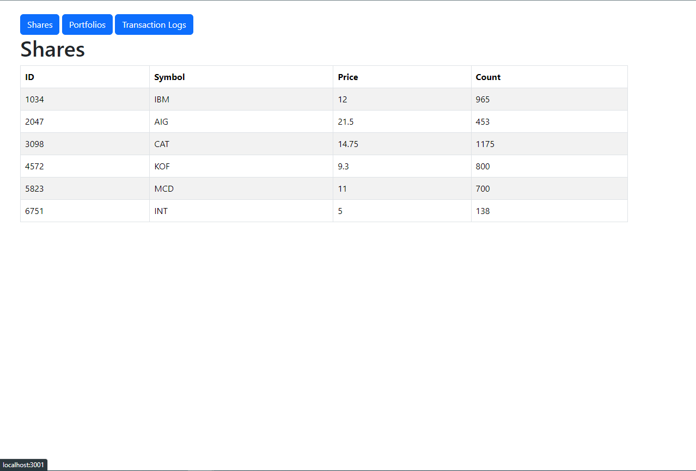
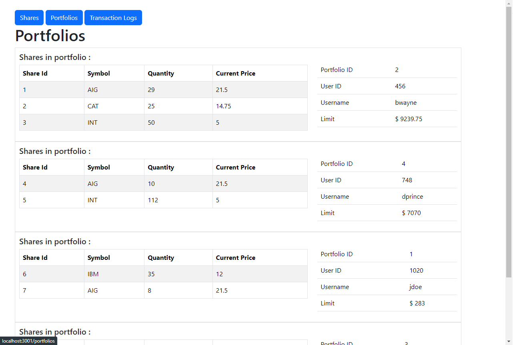
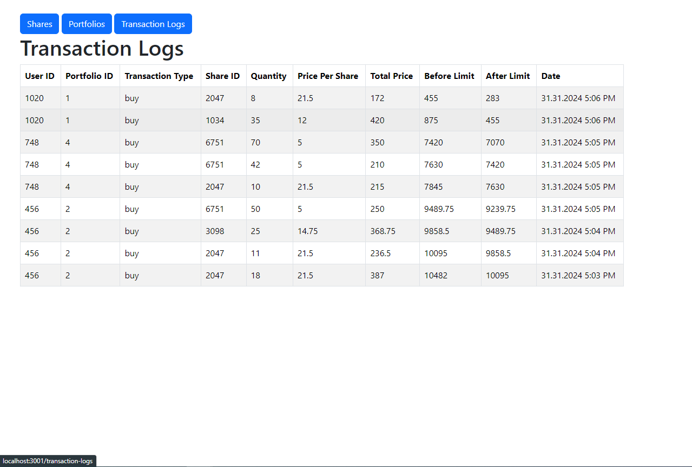

# SuperTraders
- SuperTraders is a trading platform that allows users to buy and sell shares.
- This repo includes two project :
    1. Api project (developed with **Node.js**, **PostgreSQL**, **Sequelize**, and **Express.js**).
    2. Web project (developed with **Reactjs**)

## Installation

1. Clone the repository:
    ```sh
    git clone https://github.com/muratsercann/SuperTraders.git
    ```
2. Install the required dependencies for the **api** project:
    ```sh
    cd supertraders
    npm install
    ```
4. Configure the database settings in `src/database/config.js` to match your setup.

4. Start the api project:
    ```sh
    cd supertrades
    npm start
    ```
    When the application is first run, the database and tables will be created automatically if they do not already exist. And seeded with users and shares and transactions for buy and sell.
5. Start the web project :
    ```sh
    cd supertraders/web
    npm start
    ```

## Endpoints : 
- `post http://localhost:3000/api/trade/buy`      : buys a share for a user portfolio
- `post http://localhost:3000/api/trade/sell`     : sells a share for a user portfolio
- `get  http://localhost:3000/api/trade/shares`   : gets all shares
- `get  http://localhost:3000/api/trade/users`    : gets all users with relational data
- `get  http://localhost:3000/api/trade/logs`     : gets all transaction logs

**Note : For testing buy and sell endpoints via postman, you can import and use the json file, I exported from the postman, in the `postman/` folder.** 

### Buy Endpoint

- URL: `/api/trade/buy`
- Method: `POST`
- Request Format:
    ```json
    {
        "userId": 1,
        "shareId": 1,
        "quantity": 1
    }
    ```
#### Description: 
If the user has a portfolio and the portfolio limit is sufficient, the specified amount of the shares is purchased. The `quantity` in the `Share` table is reduced by the amount specified in the request body. The share are added to the user's portfolio by specified amount, and the portfolio limit is decreased by the total price.

### Sell Endpoint

- URL: `/api/trade/sell`
- Method: `POST`
- Request Format:
    ```json
    {
        "userId": 1,
        "shareId": 1,
        "quantity": 1
    }
    ```
#### Description: 
If the user has enough of the specified share in his portfolio, the specified amount of the shares is sold. The `quantity` in the `Share` table is increased by the amount, the shares are removed from the user's portfolio by the amount specified in the request body, and the portfolio limit is increased by the total price.

## Database Structure

### Tables

1. **Share**: Stores share information.
    - `id`: Share ID
    - `symbol`: Share symbol
    - `currentPrice`: Current price of the share
    - `quantity`: Quantity of the share
    - **timestamps** is true

2. **User**: Stores user information.
    - `id`: User ID
    - `username`: Username
    - `email`: User email address
    -  **timestamps** is true

3. **Portfolio**: Stores user portfolio information.
    - `id`: Portfolio ID
    - `userId (FK)`: User ID 
    - `name`: Portfolio name
    - `description`: Portfolio description
    - `limit`: Portfolio limit for trading shares
    -  **timestamps** is true

4. **PortfolioShare**: Stores information about shares in portfolios.
    - `id`: Record ID
    - `portfolioId (FK)`: Portfolio ID
    - `shareId (FK)`: Share ID
    - `quantity`: Quantity of the share in the portfolio
    -  **timestamps** is true

5. **Transactionlog**: Stores transaction logs.
    - `id`: Record ID
    - `userId`: User ID
    - `portfolioId`: Portfolio ID
    - `shareId`: Share ID
    - `transactionType`: Type of transaction (buy/sell)
    - `quantity`: Transaction quantity
    - `pricePerShare`: Price per share
    - `totalPrice`: Total price
    - `beforeLimit`: Limit before the transaction
    - `afterLimit`: Limit after the transaction
    -  **timestamps** is true

## Web Interface

In the `web` directory of this repo, there is a `React.js` project that provides a web interface to view the data in the database. This web interface has three pages:

1. `Shares`: Displays all shares.
2. `Portfolios`: Shows all portfolios with user info and the shares within those portfolios.
3. `Transactionlog`: Displays the transaction history

### Running the Web Interface

1. Navigate to the `web` directory:
    ```sh
    cd web
    ```
2. Install the required dependencies:
    ```sh
    npm install
    ```
3. Start the React application:
    ```sh
    npm start
    ```
    The web interface will be available at `http://localhost:3001`. If you want to change the PORT, update it from the `.env` file

## Screenshots from the web project






